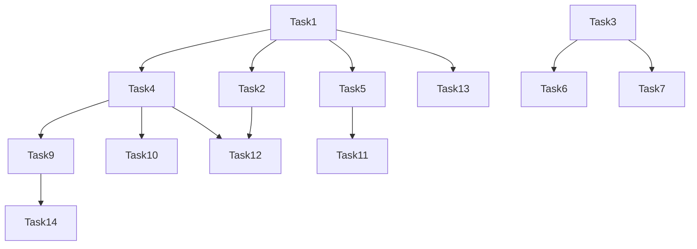

# MathCore 项目开发计划

## 1. 项目概述

MathCore 是一个基于 Rust 的微内核计算引擎，专为本地、零延迟的数学运算设计。它采用微内核+插件架构，将 LLM 定位为自然语言接口层，同时保持核心计算完全本地化。项目目前处于 Phase 2 阶段（性能与 GPU）。

## 2. 开发目标

基于审查报告的发现，本开发计划旨在解决以下核心问题：

1. 统一模块命名，确保所有模块命名一致
2. 完善 Sandbox 模块的 seccomp 功能实现
3. 增强 Python 绑定的实现，提供完整的功能支持
4. 优化符号计算和数值计算的性能
5. 完善零拷贝数据平面的实现
6. 增强安全措施，包括 seccomp 和 cgroups
7. 完善文档，包括 API 文档和使用教程
8. 增强测试覆盖，包括边缘情况和集成测试
9. 完善 CI/CD 配置，实现自动化文档生成

## 3. 任务优先级

| 优先级 | 任务类别 | 任务描述 |
|--------|----------|----------|
| P0 | 架构改进 | 统一模块命名，确保所有模块命名一致 |
| P0 | 代码质量 | 完善 Sandbox 模块的 seccomp 功能实现 |
| P0 | 代码质量 | 增强 Python 绑定的实现，提供完整的功能支持 |
| P0 | 性能优化 | 优化符号计算和数值计算的性能 |
| P1 | 架构改进 | 完善零拷贝数据平面的实现 |
| P1 | 安全增强 | 实现完整的 seccomp 系统调用白名单 |
| P1 | 安全增强 | 增加 cgroups 资源隔离机制 |
| P1 | 文档完善 | 更新各阶段任务文档，确保与当前项目状态一致 |
| P1 | 文档完善 | 编写详细的 API 文档和使用教程 |
| P2 | 测试增强 | 增加边缘情况的测试用例 |
| P2 | 测试增强 | 完善性能测试覆盖，包括更多场景的性能测试 |
| P2 | 测试增强 | 增加集成测试，确保模块间的协作正常 |
| P2 | 最佳实践 | 完善 CI/CD 配置，增加更多的检查项 |
| P2 | 最佳实践 | 实现自动化的文档生成 |
| P2 | 最佳实践 | 建立代码审查流程，确保代码质量 |

## 4. 详细任务计划

### 4.1 架构改进

#### Task 1: 统一模块命名
- **Priority**: P0
- **Depends On**: None
- **Description**:
  - 统一所有模块的命名，确保命名一致
  - 特别是 compute 模块，将其从 mathkernel 重命名为 mathcore-compute
  - 更新所有相关的导入和依赖关系
- **Success Criteria**:
  - 所有模块命名一致，遵循 mathcore-* 前缀
  - 所有导入和依赖关系更新正确
  - 项目能够正常构建和测试
- **Test Requirements**:
  - `programmatic` TR-1.1: 项目能够正常构建 (`cargo build`)
  - `programmatic` TR-1.2: 所有测试能够通过 (`cargo test`)
- **Notes**:
  - 需要更新 Cargo.toml 文件中的包名
  - 需要更新所有相关的导入语句
  - 需要更新 CI/CD 配置文件中的引用

#### Task 2: 完善零拷贝数据平面的实现
- **Priority**: P1
- **Depends On**: Task 1
- **Description**:
  - 完善零拷贝数据平面的实现，提高数据传输性能
  - 实现 Apache Arrow 数据格式的支持
  - 实现 GPU DMA-Buf 支持
- **Success Criteria**:
  - 零拷贝数据平面功能完整
  - 数据传输性能达到预期目标
  - 与现有模块集成良好
- **Test Requirements**:
  - `programmatic` TR-2.1: 数据传输性能测试通过
  - `programmatic` TR-2.2: 与现有模块集成测试通过
- **Notes**:
  - 需要与 render 模块协调工作
  - 需要考虑跨平台兼容性

### 4.2 代码质量改进

#### Task 3: 完善 Sandbox 模块的 seccomp 功能实现
- **Priority**: P0
- **Depends On**: None
- **Description**:
  - 完善 Sandbox 模块的 seccomp 功能实现
  - 实现系统调用白名单机制
  - 增加资源限制和隔离机制
- **Success Criteria**:
  - seccomp 功能完整实现
  - 系统调用白名单机制有效
  - 资源限制和隔离机制正常工作
- **Test Requirements**:
  - `programmatic` TR-3.1: seccomp 功能测试通过
  - `programmatic` TR-3.2: 资源限制测试通过
- **Notes**:
  - 需要考虑不同平台的 seccomp 支持
  - 需要与 kernel 模块协调工作

#### Task 4: 增强 Python 绑定的实现
- **Priority**: P0
- **Depends On**: Task 1
- **Description**:
  - 增强 Python 绑定的实现，提供完整的功能支持
  - 实现与 Rust 核心功能的完整绑定
  - 提供 Python 风格的 API
- **Success Criteria**:
  - Python 绑定功能完整
  - 与 Rust 核心功能保持一致
  - Python API 设计符合 Python 最佳实践
- **Test Requirements**:
  - `programmatic` TR-4.1: Python 绑定功能测试通过
  - `programmatic` TR-4.2: Python API 文档测试通过
- **Notes**:
  - 需要使用 PyO3 库
  - 需要考虑 Python 版本兼容性

#### Task 5: 优化符号计算和数值计算的性能
- **Priority**: P0
- **Depends On**: Task 1
- **Description**:
  - 优化符号表达式的缓存机制
  - 优化数值计算中的算法选择
  - 优化消息序列化和反序列化的性能
- **Success Criteria**:
  - 符号计算性能提升
  - 数值计算性能提升
  - 消息序列化和反序列化性能提升
- **Test Requirements**:
  - `programmatic` TR-5.1: 性能测试通过，达到预期目标
  - `programmatic` TR-5.2: 功能测试通过，确保正确性
- **Notes**:
  - 需要使用性能测试框架
  - 需要考虑不同场景的性能优化

### 4.3 安全增强

#### Task 6: 实现完整的 seccomp 系统调用白名单
- **Priority**: P1
- **Depends On**: Task 3
- **Description**:
  - 实现完整的 seccomp 系统调用白名单
  - 确保只有必要的系统调用被允许
  - 增加安全审计机制
- **Success Criteria**:
  - seccomp 系统调用白名单完整
  - 安全审计机制正常工作
  - 系统调用白名单有效防止恶意代码执行
- **Test Requirements**:
  - `programmatic` TR-6.1: seccomp 系统调用白名单测试通过
  - `programmatic` TR-6.2: 安全审计测试通过
- **Notes**:
  - 需要考虑不同平台的系统调用差异
  - 需要与 Sandbox 模块协调工作

#### Task 7: 增加 cgroups 资源隔离机制
- **Priority**: P1
- **Depends On**: Task 3
- **Description**:
  - 增加 cgroups 资源隔离机制
  - 实现 CPU、内存、磁盘 I/O 等资源的限制
  - 与 Sandbox 模块集成
- **Success Criteria**:
  - cgroups 资源隔离机制完整
  - 资源限制功能正常工作
  - 与 Sandbox 模块集成良好
- **Test Requirements**:
  - `programmatic` TR-7.1: cgroups 资源隔离测试通过
  - `programmatic` TR-7.2: 与 Sandbox 模块集成测试通过
- **Notes**:
  - 需要考虑不同平台的 cgroups 支持
  - 需要与 kernel 模块协调工作

### 4.4 文档完善

#### Task 8: 更新各阶段任务文档
- **Priority**: P1
- **Depends On**: None
- **Description**:
  - 更新各阶段任务文档，确保与当前项目状态一致
  - 确保文档内容准确反映项目的当前状态和计划
  - 增加详细的任务描述和交付标准
- **Success Criteria**:
  - 各阶段任务文档更新完成
  - 文档内容准确反映项目的当前状态和计划
  - 文档格式规范，易于阅读
- **Test Requirements**:
  - `human-judgement` TR-8.1: 文档内容准确，反映项目当前状态
  - `human-judgement` TR-8.2: 文档格式规范，易于阅读
- **Notes**:
  - 需要更新 docs/phase1_tasks.md, docs/phase2_tasks.md, docs/phase3_tasks.md, docs/phase4_tasks.md
  - 需要与项目计划保持一致

#### Task 9: 编写详细的 API 文档和使用教程
- **Priority**: P1
- **Depends On**: Task 1, Task 4
- **Description**:
  - 编写详细的 API 文档，包括 Rust 和 Python API
  - 编写详细的使用教程，包括安装、配置和使用方法
  - 提供示例代码和常见问题解答
- **Success Criteria**:
  - API 文档完整，覆盖所有公共 API
  - 使用教程详细，易于理解和使用
  - 示例代码和常见问题解答完整
- **Test Requirements**:
  - `human-judgement` TR-9.1: API 文档完整，覆盖所有公共 API
  - `human-judgement` TR-9.2: 使用教程详细，易于理解和使用
- **Notes**:
  - 需要使用 Rustdoc 生成 API 文档
  - 需要使用 Sphinx 生成 Python API 文档
  - 需要提供多格式的文档（HTML、PDF）

### 4.5 测试增强

#### Task 10: 增加边缘情况的测试用例
- **Priority**: P2
- **Depends On**: Task 1, Task 3, Task 4
- **Description**:
  - 增加边缘情况的测试用例，覆盖各种异常情况
  - 测试符号计算和数值计算的边界情况
  - 测试 Sandbox 模块的异常处理
- **Success Criteria**:
  - 边缘情况测试用例完整
  - 测试覆盖率达到 90% 以上
  - 所有测试用例通过
- **Test Requirements**:
  - `programmatic` TR-10.1: 边缘情况测试用例完整
  - `programmatic` TR-10.2: 测试覆盖率达到 90% 以上
- **Notes**:
  - 需要使用 Rust 的测试框架
  - 需要考虑各种异常情况

#### Task 11: 完善性能测试覆盖
- **Priority**: P2
- **Depends On**: Task 1, Task 5
- **Description**:
  - 完善性能测试覆盖，包括更多场景的性能测试
  - 测试符号计算和数值计算的性能
  - 测试数据传输和序列化的性能
- **Success Criteria**:
  - 性能测试覆盖完整
  - 性能测试结果符合预期目标
  - 性能测试可重复，结果稳定
- **Test Requirements**:
  - `programmatic` TR-11.1: 性能测试覆盖完整
  - `programmatic` TR-11.2: 性能测试结果符合预期目标
- **Notes**:
  - 需要使用 criterion 性能测试框架
  - 需要考虑不同硬件环境的性能差异

#### Task 12: 增加集成测试
- **Priority**: P2
- **Depends On**: Task 1, Task 2, Task 4
- **Description**:
  - 增加集成测试，确保模块间的协作正常
  - 测试完整的计算流程
  - 测试不同模块的集成场景
- **Success Criteria**:
  - 集成测试覆盖完整
  - 所有集成测试通过
  - 模块间的协作正常
- **Test Requirements**:
  - `programmatic` TR-12.1: 集成测试覆盖完整
  - `programmatic` TR-12.2: 所有集成测试通过
- **Notes**:
  - 需要使用 Rust 的集成测试框架
  - 需要考虑不同模块的集成场景

### 4.6 最佳实践遵循

#### Task 13: 完善 CI/CD 配置
- **Priority**: P2
- **Depends On**: Task 1
- **Description**:
  - 完善 CI/CD 配置，增加更多的检查项
  - 增加代码质量检查、安全检查和性能测试
  - 优化 CI/CD 流程，提高构建效率
- **Success Criteria**:
  - CI/CD 配置完善，包含所有必要的检查项
  - CI/CD 流程运行正常，构建效率高
  - 所有检查项通过
- **Test Requirements**:
  - `programmatic` TR-13.1: CI/CD 配置完善，包含所有必要的检查项
  - `programmatic` TR-13.2: CI/CD 流程运行正常，构建效率高
- **Notes**:
  - 需要更新 .github/workflows/ci.yml 文件
  - 需要考虑不同平台的构建需求

#### Task 14: 实现自动化的文档生成
- **Priority**: P2
- **Depends On**: Task 9
- **Description**:
  - 实现自动化的文档生成，包括 API 文档和使用教程
  - 集成文档生成到 CI/CD 流程中
  - 提供多格式的文档输出
- **Success Criteria**:
  - 自动化文档生成功能完整
  - 文档生成集成到 CI/CD 流程中
  - 文档格式规范，易于阅读
- **Test Requirements**:
  - `programmatic` TR-14.1: 自动化文档生成功能完整
  - `programmatic` TR-14.2: 文档生成集成到 CI/CD 流程中
- **Notes**:
  - 需要使用 Rustdoc 和 Sphinx
  - 需要考虑文档的版本控制

#### Task 15: 建立代码审查流程
- **Priority**: P2
- **Depends On**: None
- **Description**:
  - 建立代码审查流程，确保代码质量
  - 制定代码审查指南和标准
  - 集成代码审查到 CI/CD 流程中
- **Success Criteria**:
  - 代码审查流程完整，包含所有必要的步骤
  - 代码审查指南和标准明确
  - 代码审查集成到 CI/CD 流程中
- **Test Requirements**:
  - `human-judgement` TR-15.1: 代码审查流程完整，包含所有必要的步骤
  - `human-judgement` TR-15.2: 代码审查指南和标准明确
- **Notes**:
  - 需要制定详细的代码审查指南
  - 需要考虑代码审查的效率和质量

## 5. 里程碑

| 里程碑 | 时间点 | 完成任务 | 交付物 |
|--------|--------|----------|--------|
| 里程碑 1: 架构与命名统一 | 第 1 周 | Task 1 | 统一命名的模块结构 |
| 里程碑 2: 核心功能完善 | 第 4 周 | Task 3, Task 4, Task 5 | 完善的 Sandbox 功能、Python 绑定和性能优化 |
| 里程碑 3: 安全增强 | 第 6 周 | Task 6, Task 7 | 完整的安全机制 |
| 里程碑 4: 文档与测试 | 第 8 周 | Task 8, Task 9, Task 10, Task 11, Task 12 | 完善的文档和测试覆盖 |
| 里程碑 5: 最佳实践 | 第 10 周 | Task 13, Task 14, Task 15 | 完善的 CI/CD 配置和代码审查流程 |
| 里程碑 6: 项目交付 | 第 12 周 | 所有任务 | 完整的 MathCore 项目 |

## 6. 团队成员分配

| 任务类别 | 负责团队成员 | 职责 |
|----------|--------------|------|
| 架构改进 | 后端架构师 | 统一模块命名，完善零拷贝数据平面 |
| 代码质量 | 核心开发者 | 完善 Sandbox 功能，增强 Python 绑定，优化性能 |
| 安全增强 | 安全专家 | 实现 seccomp 和 cgroups 功能，进行安全审计 |
| 文档完善 | 文档工程师 | 更新阶段任务文档，编写 API 文档和使用教程 |
| 测试增强 | 测试工程师 | 增加边缘情况测试，完善性能测试，增加集成测试 |
| 最佳实践 | DevOps 工程师 | 完善 CI/CD 配置，实现自动化文档生成，建立代码审查流程 |

## 7. 时间线

| 周次 | 完成任务 |
|------|----------|
| 第 1 周 | Task 1 |
| 第 2-3 周 | Task 3, Task 4 |
| 第 4 周 | Task 5 |
| 第 5-6 周 | Task 6, Task 7 |
| 第 7-8 周 | Task 8, Task 9, Task 10, Task 11, Task 12 |
| 第 9-10 周 | Task 13, Task 14, Task 15 |
| 第 11-12 周 | 项目整合与测试 |

## 8. 依赖关系

## 9. 风险管理

| 风险 | 概率 | 影响 | 缓解措施 |
|------|------|------|----------|
| 模块命名统一导致的依赖问题 | 中 | 高 | 仔细规划重命名过程，确保所有依赖关系更新正确 |
| seccomp 和 cgroups 在不同平台的兼容性 | 中 | 中 | 针对不同平台提供不同的实现，确保核心功能在所有平台可用 |
| Python 绑定的性能问题 | 低 | 中 | 优化 Python 绑定的实现，使用 PyO3 的最佳实践 |
| 性能优化的复杂性 | 中 | 高 | 分阶段进行性能优化，确保每次优化都有明确的目标和测试 |
| 文档生成的自动化 | 低 | 中 | 使用成熟的文档生成工具，确保文档生成流程稳定可靠 |

## 10. 进度跟踪

### 10.1 任务状态跟踪

| 任务 ID | 任务名称 | 状态 | 负责人 | 开始日期 | 预计完成日期 | 实际完成日期 |
|---------|----------|------|--------|----------|--------------|--------------|
| Task 1 | 统一模块命名 | [ ] | 后端架构师 | 2026-03-07 | 2026-03-13 | |
| Task 2 | 完善零拷贝数据平面 | [ ] | 后端架构师 | 2026-03-14 | 2026-03-27 | |
| Task 3 | 完善 Sandbox 模块的 seccomp 功能 | [ ] | 核心开发者 | 2026-03-14 | 2026-03-27 | |
| Task 4 | 增强 Python 绑定的实现 | [ ] | 核心开发者 | 2026-03-14 | 2026-03-27 | |
| Task 5 | 优化符号计算和数值计算的性能 | [ ] | 核心开发者 | 2026-03-28 | 2026-04-03 | |
| Task 6 | 实现完整的 seccomp 系统调用白名单 | [ ] | 安全专家 | 2026-04-04 | 2026-04-17 | |
| Task 7 | 增加 cgroups 资源隔离机制 | [ ] | 安全专家 | 2026-04-04 | 2026-04-17 | |
| Task 8 | 更新各阶段任务文档 | [ ] | 文档工程师 | 2026-04-18 | 2026-04-24 | |
| Task 9 | 编写详细的 API 文档和使用教程 | [ ] | 文档工程师 | 2026-04-18 | 2026-04-24 | |
| Task 10 | 增加边缘情况的测试用例 | [ ] | 测试工程师 | 2026-04-18 | 2026-04-24 | |
| Task 11 | 完善性能测试覆盖 | [ ] | 测试工程师 | 2026-04-18 | 2026-04-24 | |
| Task 12 | 增加集成测试 | [ ] | 测试工程师 | 2026-04-18 | 2026-04-24 | |
| Task 13 | 完善 CI/CD 配置 | [ ] | DevOps 工程师 | 2026-04-25 | 2026-05-08 | |
| Task 14 | 实现自动化的文档生成 | [ ] | DevOps 工程师 | 2026-04-25 | 2026-05-08 | |
| Task 15 | 建立代码审查流程 | [ ] | DevOps 工程师 | 2026-04-25 | 2026-05-08 | |

### 10.2 每周进度报告

每周五提交进度报告，包括：

- 本周完成的任务
- 下周计划完成的任务
- 遇到的问题和解决方案
- 需要协调的事项

## 11. 资源分配

### 11.1 人力需求

| 角色 | 人数 | 职责 |
|------|------|------|
| 后端架构师 | 1 | 负责架构设计和改进 |
| 核心开发者 | 2 | 负责核心功能的实现和优化 |
| 安全专家 | 1 | 负责安全功能的实现和审计 |
| 文档工程师 | 1 | 负责文档的编写和更新 |
| 测试工程师 | 1 | 负责测试的设计和执行 |
| DevOps 工程师 | 1 | 负责 CI/CD 和自动化流程 |

### 11.2 硬件需求

| 设备 | 数量 | 用途 |
|------|------|------|
| 开发服务器 | 1 | 用于 CI/CD 构建和测试 |
| 测试设备 | 3 | 用于不同平台的测试 |
| 性能测试设备 | 1 | 用于性能测试和优化 |

## 12. 结论

本开发计划基于审查报告的发现，旨在解决项目中存在的问题，同时保持项目的优势。计划包含了优先排序的任务、明确的里程碑、负责团队成员、预估时间线以及任务之间的依赖关系。通过实施本计划，MathCore 项目将进一步完善其架构、代码质量、安全措施、文档和测试，成为一个更加成熟和强大的数学计算引擎。

计划的实施将遵循以下原则：

1. 优先解决高优先级的任务
2. 确保任务之间的依赖关系
3. 定期跟踪进度，及时调整计划
4. 注重代码质量和测试覆盖
5. 保持与项目战略目标的一致性

通过团队的协作和努力，MathCore 项目将实现其设计目标，成为一个优秀的数学计算引擎。