# MathCore v6.0 (数学核心)

[](LICENSE)
[](https://www.rust-lang.org/)
[]()
[]()

> A high-performance local mathematical computation engine for high school to university-level mathematics.
>
> 面向高中到大学级别数学的高性能本地数学计算引擎。

---

## 简介 / Introduction

MathCore is a **Rust-based micro-kernel computation engine** designed for local, zero-latency mathematical operations. It uses a micro-kernel + plugin architecture with LLMs positioned as a natural language interface layer while keeping core computation fully local.

MathCore 是一个**基于 Rust 的微内核计算引擎**，专为本地、零延迟的数学运算设计。它采用微内核 + 插件架构，将 LLM 定位为自然语言接口层，同时保持核心计算完全本地化。

**Key Design Principles / 核心设计原则:**

| English | 中文 |
|---------|------|
| Mathematical rigor through local computation | 本地计算保证数学严谨性 |
| Zero-latency response times | 零延迟响应 |
| Micro-kernel architecture with plugin extensions | 微内核架构 + 插件扩展 |
| Security through process isolation and sandboxing | 进程隔离与沙箱安全保障 |

---

## 特性 / Features

### 符号计算 / Symbolic Computation

| English | 中文 |
|---------|------|
| Expression parsing and AST manipulation | 表达式解析与 AST 操作 |
| Algebraic simplification | 代数化简 |
| Symbolic differentiation | 符号求导 |
| Symbolic integration | 符号积分 |
| Equation solving | 方程求解 |

### 数值计算 / Numeric Computation

| English | 中文 |
|---------|------|
| High-precision numerical evaluation | 高精度数值计算 |
| Numerical integration | 数值积分 |
| Root finding algorithms | 求根算法 |
| Floating-point optimizations | 浮点优化 |

### MessagePack 协议 / MessagePack Protocol

| English | 中文 |
|---------|------|
| Compact binary serialization (rmp-serde) | 紧凑二进制序列化 |
| Efficient message passing between components | 高效组件间消息传递 |
| Versioned protocol design | 版本化协议设计 |

### CLI 接口 / CLI Interface

| English | 中文 |
|---------|------|
| Direct command-line computation | 命令行直接计算 |
| Support for variable substitution | 支持变量替换 |
| Expression simplification | 表达式化简 |
| Derivative and integral calculation | 求导与积分计算 |

---

## 架构 / Architecture

```mermaid
flowchart TB
    
    subgraph PL["Presentation Layer / 展示层"]
        direction LR
        TUI["TUI"]
        GUI["GUI"]
        Jupyter["Jupyter"]
        VSCode["VS Code"]
        MCP["MCP Clients"]
    end
    
    subgraph BUS["MathCore Bus / 消息总线"]
        direction LR
        Routing["Message Routing / 消息路由"]
        LoadBalancing["Load Balancing / 负载均衡"]
        Broadcasting["Event Broadcasting / 事件广播"]
    end
    
    subgraph KERNEL["MathCore Kernel / 微内核"]
        direction LR
        Isolation["Process Isolation / 进程隔离"]
        Quotas["Resource Quotas / 资源配额"]
        Lifecycle["Plugin Lifecycle / 插件生命周期"]
        Sandbox["Security Sandbox / 安全沙箱"]
        HotReload["Hot Reload / 热重载"]
    end
    
    subgraph EXT["Extensions Domain / 扩展域"]
        direction LR
        subgraph COMPUTE["ComputeExt / 计算扩展"]
            direction LR
            Symbolic["Symbolic / 符号计算"]
            Numeric["Numeric / 数值计算"]
            External["External / 外部调用"]
        end
        
        subgraph RENDER["RenderExt / 渲染扩展"]
            direction LR
            wgpu["wgpu"]
            Vulkan["Vulkan"]
            Metal["Metal"]
        end
        
        subgraph KNOWLEDGE["KnowledgeExt / 知识扩展"]
            direction LR
            TheoremDB["TheoremDB / 定理库"]
            Curriculum["Curriculum / 课程体系"]
            SymbolTable["SymbolTable / 符号表"]
        end
        
        BRIDGE["BridgeExt: MCP | gRPC | HTTP | Jupyter"]
    end
    
    subgraph DATA["Zero-Copy Data Plane / 零拷贝数据平面"]
        direction LR
        Shm["Shared Memory / 共享内存"]
        DMABuf["GPU DMA-Buf"]
        Arrow["Apache Arrow"]
        FlatBuffers["FlatBuffers"]
    end
    
    PL --> BUS --> KERNEL --> EXT --> DATA
    
    style PL fill:#e1f5fe,stroke:#01579b
    style BUS fill:#e8f5e9,stroke:#2e7d32
    style KERNEL fill:#fff3e0,stroke:#e65100
    style EXT fill:#f3e5f5,stroke:#7b1fa2
    style DATA fill:#ffebee,stroke:#c62828
```



---

## 安装 / Installation

### 前置条件 / Prerequisites

- [Rust](https://rustup.rs/) (stable toolchain, 2021 edition) | Rust (稳定工具链，2021 edition)
- Cargo (comes with Rust) | Cargo (随 Rust 一起安装)

### 从源码构建 / Build from Source

```bash
# 克隆仓库 / Clone the repository
git clone https://github.com/mathcore/mathcore.git
cd mathcore

# 构建项目 / Build the project
cargo build --release

# 运行测试 / Run tests
cargo test
```

### 可用 Crates / Available Crates

| Crate | 描述 / Description | 状态 / Status |
|-------|---------------------|---------------|
| `mathcore-kernel` | 微内核 (总线与沙箱) / Micro-kernel with bus and sandbox | ✅ Complete |
| `mathcore-compute` | 符号与数值计算 / Symbolic and numeric computation | ✅ Complete |
| `mathcore-render` | GPU 渲染引擎 (wgpu) / GPU rendering engine | Phase 2 |
| `mathcore-bridge` | 协议桥接 (MCP, gRPC) / Protocol bridges | Phase 4 |
| `mathcore-cli` | 命令行接口 / Command-line interface | ✅ Complete |
| `mathcore-smt` | SMT 求解器集成 / SMT solver integration | Phase 3 |
| `mathcore-symbols` | 符号系统 / Symbol system | Phase 3 |
| `mathcore-verification` | 定理验证 / Theorem verification | Phase 3 |
| `mathcore-mcp` | MCP 协议服务器 / MCP protocol server | Phase 4 |

---

## 使用 / Usage

### CLI 命令 / CLI Commands

MathCore 提供强大的命令行数学计算功能:

```bash
# 计算表达式 (带变量替换) / Compute expression with variable substitution
cargo run --package mathcore-cli -- compute "x^2 + 2*x + 1" --x=3
# Output: 16

# 化简表达式 / Simplify an expression
cargo run --package mathcore-cli -- simplify "(x + 1)^2 - (x - 1)^2"
# Output: 4*x

# 求导 / Calculate derivative
cargo run --package mathcore-cli -- diff "x^2 + sin(x)" --var=x
# Output: 2*x + cos(x)

# 计算定积分 / Calculate definite integral
cargo run --package mathcore-cli -- integrate "x^2" --var=x --from=0 --to=1
# Output: 0.3333333333333333

# 显示版本 / Show version
cargo run --package mathcore-cli -- version

# 显示帮助 / Display help
cargo run --package mathcore-cli -- help
```

### 编程使用 / Programmatic Usage

```rust
use mathcore_compute::symbolic::SymbolicEngine;
use mathcore_compute::numeric::NumericEngine;

fn main() {
    // 符号计算 / Symbolic computation
    let engine = SymbolicEngine::new();
    let expr = engine.parse("x^2 + 2*x + 1").unwrap();
    let simplified = engine.simplify(&expr);
    
    // 数值计算 / Numeric evaluation
    let numeric = NumericEngine::new();
    let result = numeric.eval_with_vars("x^2", &[("x", 3.0)]).unwrap();
    println!("Result: {}", result); // 9.0
}
```

---

## 项目路线图 / Project Roadmap

### Phase 1: 内核与 MessagePack / Kernel & MessagePack (Week 1-5) ✅ 已完成

- [x] 项目骨架 (Cargo workspace, CI/CD) / Project skeleton
- [x] 微内核核心 (Kernel, Bus, Sandbox) / Micro-kernel core
- [x] MessagePack 协议层 / MessagePack protocol layer
- [x] 计算扩展 (符号, 数值) / Compute extensions
- [x] CLI 接口 / CLI interface
- [x] 单元测试 (266 测试全部通过) / Unit tests (266 tests passing)

### Phase 2: 性能与 GPU / Performance & GPU (Week 6-9) 🔄 进行中

- [ ] VizEngine (wgpu 渲染) / wgpu rendering
- [ ] 零拷贝数据平面 (Arrow + DMA-Buf) / Zero-copy data plane
- [ ] 实时流协议 (FlatBuffers) / Real-time streaming protocol
- [ ] 性能优化 (SIMD + 缓存) / Performance optimization

### Phase 3: 严谨与验证 / Rigor & Verification (Week 10-13)

- [ ] NanoCheck (L0 语法验证) / L0 syntax validation
- [ ] SMT 集成 (Z3 求解器) / SMT integration
- [ ] Verification Mesh (三级验证) / Three-level validation
- [ ] Lean 4 桥接 (形式化证明) / Lean 4 bridge
- [ ] Unicode 符号系统 / Unicode symbol system

### Phase 4: 生态与分发 / Ecosystem & Distribution (Week 14-16)

- [ ] Python 包 (pip 可安装) / Python package
- [ ] MCP 桥接 / MCP Bridge
- [ ] 计算回放 (调试 GUI) / Computation replay
- [ ] 完整文档 / Complete documentation
- [ ] 多平台分发 / Multi-platform distribution

---

## 技术栈 / Technical Stack

| 组件 / Component | 技术 / Technology | 版本 / Version |
|------------------|-------------------|----------------|
| 核心语言 / Core Language | Rust | stable |
| 异步运行时 / Async Runtime | tokio | 1.43 |
| 序列化 / Serialization | serde, rmp-serde | 1.3+ |
| 错误处理 / Error Handling | thiserror, anyhow | 2.0, 1.0 |
| 消息传递 / Message Passing | tokio-util | 0.7 |
| 日志 / Logging | tracing, tracing-subscriber | 0.1, 0.3 |
| GPU 渲染 / GPU Rendering | wgpu | 0.19+ (Phase 2) |
| 数据平面 / Data Plane | Apache Arrow | 45.0+ (Phase 2) |
| SMT 求解器 / SMT Solver | z3-solver | 0.19+ (Phase 3) |
| Python 绑定 / Python Bindings | PyO3 | 0.20+ (Phase 4) |

---

## 项目结构 / Project Structure

```
MathCore/
├── Cargo.toml              # 工作区根配置 / Workspace root
├── rustfmt.toml            # 代码格式化规则 / Code formatting
├── .github/workflows/ci.yml # CI/CD 配置
├── ARCHITECTURE.md         # 架构文档
├── CODE_STYLE.md           # 代码风格指南
├── docs/
│   ├── project_overview_v1.2.md    # 项目概览
│   ├── technical_optimization_v1.2.md  # 技术规格
│   ├── phase1_tasks.md     # Phase 1 任务
│   ├── phase2_tasks.md     # Phase 2 任务
│   ├── phase3_tasks.md     # Phase 3 任务
│   └── phase4_tasks.md     # Phase 4 任务
└── crates/
    ├── kernel/             # 微内核
    │   └── src/
    │       ├── core/      # 内核核心运行时
    │       ├── bus/       # 消息总线
    │       ├── sandbox/   # 安全沙箱
    │       ├── protocol/  # MessagePack 协议
    │       └── error.rs   # 错误类型
    ├── compute/           # 计算引擎
    │   └── src/
    │       ├── symbolic/  # 符号计算
    │       └── numeric/   # 数值计算
    ├── render/            # GPU 渲染 (Phase 2)
    ├── bridge/           # 协议桥接 (Phase 4)
    ├── cli/              # 命令行接口
    ├── smt/              # SMT 求解器 (Phase 3)
    ├── symbols/          # 符号系统 (Phase 3)
    ├── verification/     # 定理验证 (Phase 3)
    └── mcp/              # MCP 协议 (Phase 4)
```

---

## 关键性能目标 / Key Performance Targets

| 指标 / Metric | 目标 / Target | 基线 (50% 余量) / Baseline |
|---------------|---------------|----------------------------|
| 可用性 / Availability | 99.99% | - |
| L0 计算延迟 / L0 Computation Latency | <10ms | <5ms |
| L2 计算延迟 / L2 Computation Latency | <1s | <500ms |
| 10MB 矩阵传输 / 10MB Matrix Transfer | <10ms | <5ms |
| 消息序列化 / Message Serialization | <1ms | <500μs |
| 验证失败率 / Verification Failure Rate | <0.01% | <0.005% |
| 安装时间 / Installation Time | <5 分钟 | <3 分钟 |

---

## 贡献 / Contributing

欢迎社区贡献! 以下是入门指南:

1. **Fork 仓库**并创建功能分支
2. **设置开发环境**:
   ```bash
   rustup component add clippy rustfmt
   cargo install cargo-audit
   ```
3. **遵循代码风格** (见 `CODE_STYLE.md`)
4. **运行测试和检查**:
   ```bash
   cargo fmt --all -- --check
   cargo clippy --all-targets --all-features
   cargo test
   ```
5. **提交 Pull Request**并附上清晰描述

### 开发指南 / Development Guidelines

- 所有代码必须通过 `cargo clippy` 和 `cargo fmt`
- 单元测试覆盖率 > 80%
- 错误处理测试覆盖率 > 90%
- 所有公共 API 需要文档
- 提交信息遵循 conventional commits

---

## 许可证 / License

MathCore 采用双许可证:

- **MIT License**: 见 [LICENSE-MIT](LICENSE-MIT)
- **Apache License 2.0**: 见 [LICENSE-APACHE](LICENSE-APACHE)

您可以选择任一许可证使用本软件。

---

## 致谢 / Acknowledgments

MathCore 由 MathCore Team 开发。特别感谢 Rust 社区和所有开源贡献者。

---

## 联系方式 / Contact

- **项目 / Project**: [github.com/mathcore/mathcore](https://github.com/mathcore/mathcore)
- **团队 / Team**: team@mathcore.dev
- **问题 / Issues**: [GitHub Issues](https://github.com/mathcore/mathcore/issues)

---

<p align="center">
  <em>Mathematical Rigor. Zero Latency. Local First.</em>
  <br>
  <em>数学严谨。零延迟。本地优先。</em>
</p>
